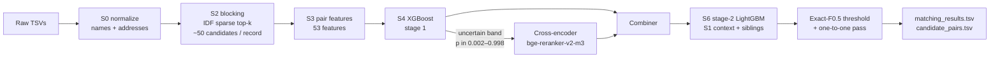

# Business Entity Resolution — Amazon ML Challenge 2026 (Team TheAnarchy)

Match every Source-1 business record to **all** of its records in Sources 2 and 3: noisy names, partial
addresses, three countries (one of them unseen in training), ~1.7M queries against ~10M pool records.

**Final result:** public leaderboard **0.968** macro-F0.5 · held-out F0.5 **0.9800 ± 0.0003** (India 0.972, US 0.985).
Final submission report: [`FINAL_SUBMISSION.md`](FINAL_SUBMISSION.md) · submitted files and dataset:
[release `final-run2-0.968`](https://github.com/RavishCRZ27/amazon-ml-challenge-2026/releases/tag/final-run2-0.968).

The pipeline uses only the provided data and local open models (Apache-2.0 / MIT, ≤ 8B parameters). No external
lookups, and nothing touches the network at inference.

---

## How it works



| Stage | What it does |
|---|---|
| **S0 normalize** | Custom Indic → Latin transliteration and accent folding (`src/translit.py`), legal-suffix removal (US / India / France forms), street-type and state codes, house numbers without leading zeros. |
| **S1 splits** | Ground-truth checks; train S1s split into TRAIN / early-stopping / **VAL** (100K, every choice) / **HOLDOUT** (100K, reported once, never used for a choice). |
| **S2 blocking** | Per-country IDF-weighted sparse retrieval (`sparse_dot_topn`) over two views: word tokens of name + address, and character 3-grams of a consonant skeleton of the name + address tokens. Union ordered by best rank, capped at 50 per record. |
| **S3 features** | 53 pair features: fuzzy name/address similarities, shared numbers, script flags, view ranks and scores, and *reverse-competition* features (how a pool record ranks this S1 among every S1 that retrieved it). |
| **S4 stage 1** | XGBoost on GPU; exact macro-F0.5 threshold sweep on VAL. |
| **S4x cross-encoder** | `BAAI/bge-reranker-v2-m3` (Apache-2.0, 568M) fine-tuned 1 epoch on 300K training pairs, raw "name \| address" text of both records. It only scores pairs stage 1 is unsure about (~10% of test pairs); a logistic combiner merges both scores. |
| **S5 inference** | Stage 1 + cross-encoder on the test band + combiner, threshold, then a one-to-one pass on the pool side (each Source-2/3 record keeps only its best S1; S1s keep any number of matches). |
| **S6 stage 2** | LightGBM re-scores every candidate from the combined probability, the S1's candidate context (rank, max, 2nd best, gap…), sibling evidence and the stage-1 features; threshold re-chosen on VAL. |

`country` is never a model feature: it only partitions retrieval, so France (test only) is handled as an open set.

## Results

Macro-F0.5 over all S1s, singletons included, recall against the full ground truth.

| System | VAL (choices) | HOLDOUT (report only) | India / US (HOLDOUT) | Public LB |
|---|---|---|---|---|
| Stage-1 XGBoost | 0.9484 ± .0005 | 0.9484 | 0.931 / 0.960 | – |
| + e5-small cross-encoder, band [0.01, 0.99] | 0.9768 ± .0003 | 0.9764 | 0.968 / 0.982 | 0.965 |
| + bge-reranker-v2-m3, band [0.002, 0.998] | 0.9796 ± .0003 | 0.9794 ± .0003 | 0.972 / 0.985 | – |
| **+ stage-2 re-scorer (final)** | **0.9800 ± .0003** | **0.9800 ± .0003** | **0.972 / 0.985** | **0.968** |

- Retrieval recall is 0.972 at ~50 candidates per record; predicting exactly the true pairs among the candidates
  would score 0.990, so the matcher, not retrieval, sets most of the remaining gap.
- Where the remaining HOLDOUT loss (0.0206) sits: true match never retrieved 0.0104, retrieved but missed 0.0069,
  false merges 0.0025, predictions on singletons 0.0009.
- France has no labels. Its F0.5 implied by the public score and the per-country HOLDOUT is about 0.91; its errors
  are mostly hard same-address and look-alike pairs.
- Every option was adopted only if its paired gain on VAL exceeded 2 standard errors; the full list of experiments
  (kept and dropped) is in [`docs/Documentation_filled.md`](docs/Documentation_filled.md).

## Final submission & downloads

The release [**final-run2-0.968**](https://github.com/RavishCRZ27/amazon-ml-challenge-2026/releases/tag/final-run2-0.968)
holds everything that was submitted, gzip-compressed, with `SHA256SUMS.txt`:

- `matching_results.tsv.gz` — the final matches scored on the leaderboard (0.968)
- `candidate_pairs.tsv.gz` — the candidate set the matcher scored
- `TheAnarchy_submission.zip` — the submitted package (both TSVs, code, methodology)
- the challenge dataset: `train_source{1,2,3}`, `train_ground_truth`, `test_source{1,2,3}` (`.tsv.gz`)

Scores, file checksums, output statistics and the checks run before the upload are in
[`FINAL_SUBMISSION.md`](FINAL_SUBMISSION.md).

## Quick start

**Environment:** Python 3.12, a CUDA 12.x GPU with ≥ 20 GB (tested on 32 vCPU, 128 GB RAM, 1× NVIDIA L4 24 GB),
~60 GB free disk.

```bash
git clone https://github.com/RavishCRZ27/amazon-ml-challenge-2026.git
cd amazon-ml-challenge-2026
python3.12 -m venv .venv
.venv/bin/pip install -r code/business_entity_resolution/requirements.txt \
    --extra-index-url https://download.pytorch.org/whl/cu124
```

**Data and model.** The dataset is attached to the release above (gunzip it into `data/dataset/`); the validator
comes with the challenge's `utils/` folder, and the model is downloaded once:

```
data/dataset/train/*.tsv, data/dataset/test/*.tsv   # the challenge's dataset/ folder
data/utils/validate_submission.py                    # the challenge's validator
models/bge-reranker-v2-m3/                           # base cross-encoder weights
```

```bash
hf download BAAI/bge-reranker-v2-m3 --local-dir models/bge-reranker-v2-m3   # once; runs are offline afterwards
```

**Run:**

```bash
bash preflight.sh               # environment, data row counts, secret scan; non-zero exit on failure
bash run_all.sh --force all     # clean end-to-end run: raw TSVs -> both TSVs -> official validator
```

Outputs land in `output/matching_results.tsv` and `output/candidate_pairs.tsv`.

- `run_all.sh` resumes from checkpoints by default (`work/**/_DONE.json` + atomic per-part parquet, keyed by config
  and code hashes). Options: `--from <stage>`, `--only <stage>`, `--force <stage|all>`, `--limit-s1 N` for a slice.
- Logs: `logs/<stage>.log`; per-stage wall time: `logs/timings.tsv`.
- `bash make_submission.sh <team>` builds the challenge zip (outputs + code + methodology) after the validator passes.
- Optional S3 backup of checkpoints runs only when `BER_S3_BUCKET` is set.

## Runtime

Measured on the machine above; a clean run takes about **5 hours** (budget: 8 h).

| Stage | Wall time |
|---|---|
| S0 normalize (24.2M records) | 4.4 min |
| S2 blocking: train (2.2M S1s) / test (1.73M S1s) | 29.3 min / 17.9 min |
| S3 features: train (19.9M pairs) / test (86.0M pairs) | 3.6 min / 8.9 min |
| S4 XGBoost + threshold sweep | ~4 min |
| S4x cross-encoder: fine-tune (300K pairs) + score the VAL/HOLDOUT band | ~34 min + ~16 min |
| S5 test inference (8.35M uncertain pairs through the cross-encoder, ~880 pairs/s) | ~2.6 h |
| S6 stage 2 | ~10 min |

## Repository layout

```
src/                  pipeline stages S0–S6 + common.py (config, checkpoints), translit.py, threshold.py
specs/                per-stage specifications (what each stage must do and how it is checked)
config.yaml           every setting (config.v1.yaml = the first run's baseline)
run_all.sh            runs the stages in order with checkpoint / resume
preflight.sh          environment, data and secret checks
make_submission.sh    builds <team>_submission.zip in the challenge layout
tools/                submission gate, paired comparisons, diagnostics and the experiments behind each decision
docs/                 methodology write-up, EDA findings and EDA code
code/business_entity_resolution/   README + pinned requirements shipped in the submission package
submissions/          per-submission metadata: config, thresholds, reports, md5s, per-S1 HOLDOUT F
```

## Evaluation protocol

- The metric is reproduced exactly: F0.5 per S1, macro-averaged, singletons included (an empty prediction on a
  singleton scores 1.0; any prediction on it scores 0.0).
- Every choice (model, features, thresholds, optional stages) is made on VAL; HOLDOUT is scored once per system
  and never used to choose.
- Every F0.5 is reported with its standard error; variants are compared with the paired SE of per-S1 differences
  over the same S1s (`src/threshold.py`, `tools/paired_f.py`).
- Each leaderboard submission passed a gate first: validator, ids and row counts, matches ⊆ candidates, HOLDOUT
  report, secret scan, and byte-identical reruns of inference (`tools/gate_run.sh`).

## Team

**TheAnarchy** — Ravish Pandey ([@RavishCRZ27](https://github.com/RavishCRZ27)), Samar Nathani ([@SammySN-car](https://github.com/SammySN-car)), Ayush Rajdeep ([@rajdeep3456](https://github.com/rajdeep3456)).

## License

Apache-2.0 for the code and documents in this repository. Third-party model weights keep their own licenses
(`bge-reranker-v2-m3`: Apache-2.0). The challenge dataset attached to the release is the organisers' data, provided
as-is for reference; it is not covered by this repository's license.
